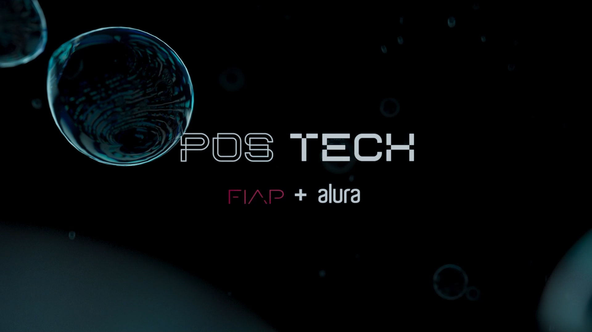

# Discord Poll Bot

Este é um bot para Discord que cria enquetes interativas em um canal e salva as respostas em um arquivo CSV.

O bot permite que os usuários votem em opções configuradas, e depois salva as respostas com detalhes como nome do usuário, resposta e data/hora do voto.

## Funcionalidades

- Criação de enquetes interativas com botões de votação;
- Armazenamento das respostas em um arquivo CSV;
- Suporte para fusos horários (com `pytz`);
- Desabilita a enquete após o tempo limite;
- Comando para salvar respostas manualmente em CSV.

## Requisitos

- Python 3.9+
- Discord.py (`discord.py`)
- Pandas (`pandas`)
- Pytz (`pytz`)

## Instalação

1. Clone o repositório:

   ```bash
   git clone https://github.com/seu-usuario/seu-repositorio.git
   cd seu-repositorio


2. Instale as dependências:

   ```bash
   pip install -r requirements.txt

3. Defina o token do bot do Discord no código:

   ```bash
   DISCORD_TOKEN = 'seu_token_aqui'

4. Execute o bot:

   ```bash
   python main.py

## Como usar
1. O bot será iniciado e pronto para enviar enquetes. 
2. Configure os channel_ids com os IDs dos canais onde você deseja enviar as enquetes.
3. A enquete será enviada com um conjunto de opções, e os usuários poderão votar clicando em botões.
4. O comando !salvar_respostas pode ser usado para salvar as respostas coletadas em um arquivo CSV.

<h2 id="colab">🤝 Colaboradores</h2>

<table>
  <tr>
    <td align="center">
      <a href="#">
        <br>
        <sub>
          <b>Fabrício Rosa</b>
        </sub>
      </a>
    </td>
    <td align="center">
      <a href="#">
        <br>
        <sub>
          <b>Eduardo Bortoli</b>
        </sub>
      </a>
    </td>
</table>
